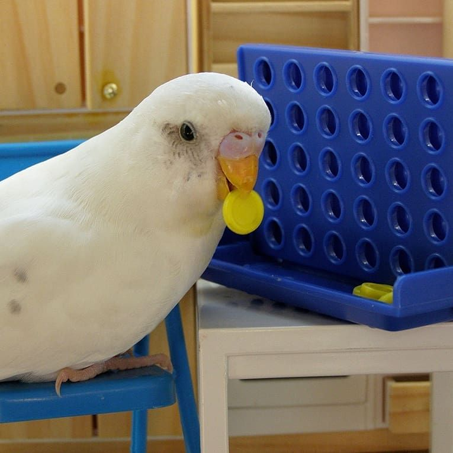

# four_in_a_row

A Treehouse project resulting in a "Connect Four" app. It applies what I have learned about object oriented programming

## Technologies and libraries
This dynamic app was written in Javascript and incorporates SVG to draw the game's board and tokens.

## Game instructions
1. Click "Start" to begin the game.

2. Two players take turns moving and dropping tokens by using the left, right, and down arrow keys to move and drop their tokens within the columns of the game board.

3. The game continues until one player wins by connecting four tokens in a row vertically, horizontally, or diagonally, or until all of the token spaces are filled.
